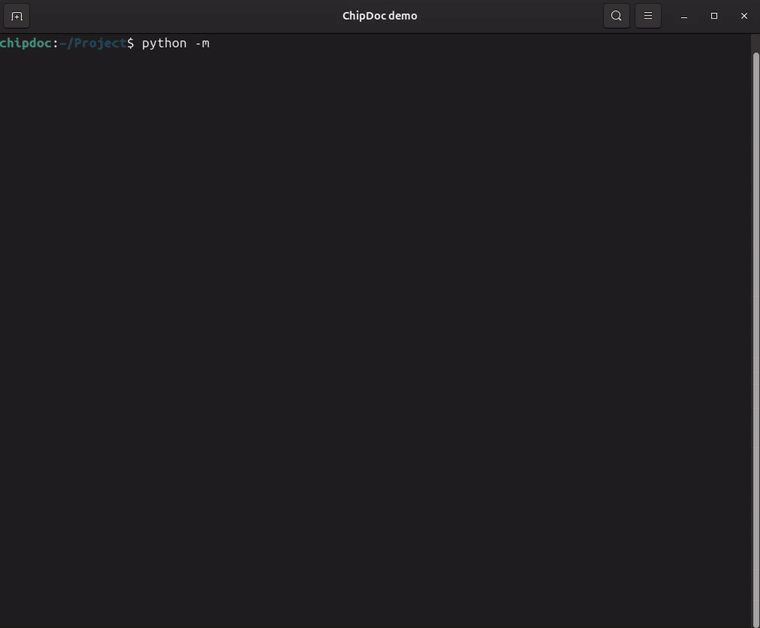
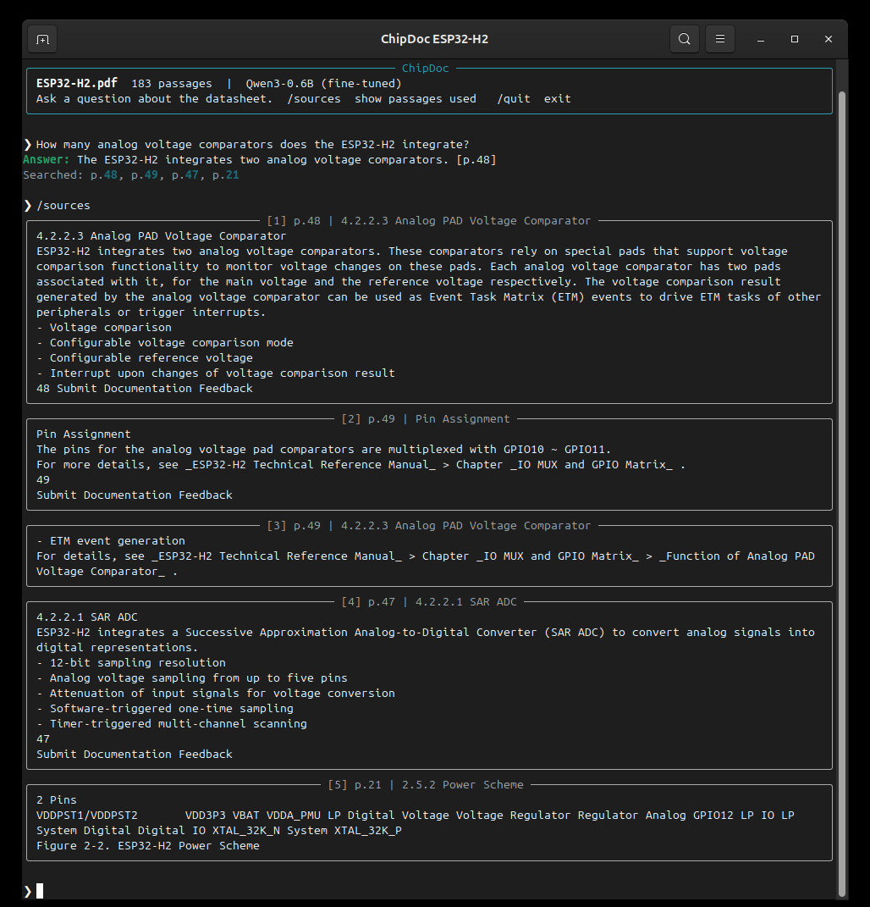
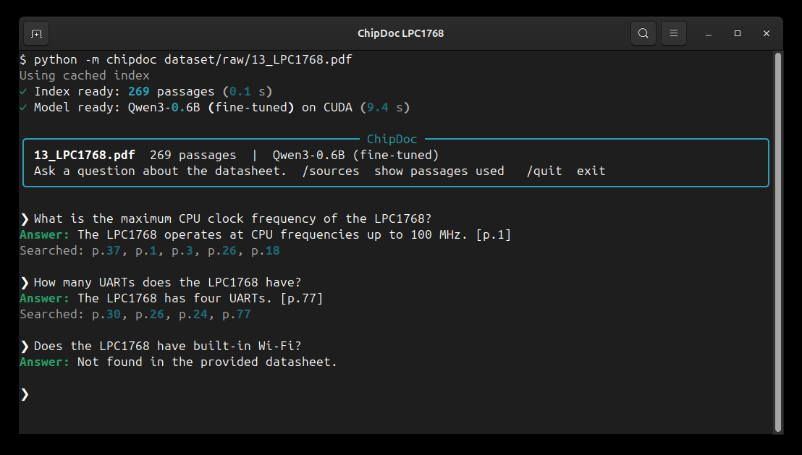

# ChipDoc AI

[](https://www.python.org/)
[](https://pytorch.org/)
[](https://huggingface.co/Qwen)
[](https://huggingface.co/BAAI/bge-small-en-v1.5)
[](#security--privacy)

> **Ask a microcontroller datasheet questions directly from your terminal, and get grounded answers cited with exact page numbers.**

---

[](docs/ChipDoc_Demo.mp4)

🎬 **[Watch the full 2-minute demo video](docs/ChipDoc_Demo.mp4)** *(the preview above runs at 2.5× speed and skips the 28 s indexing wait). Covers indexing a new PDF, loading the model, answering with page citations, refusal when information is absent, and the `/sources` command.*

---

## Table of Contents

- [Overview](#overview)
- [Key Features](#key-features)
- [Interactive Demo & Examples](#interactive-demo--examples)
- [Benchmark Results](#benchmark-results)
- [How It Works](#how-it-works)
- [System Requirements](#system-requirements)
- [Installation & Quickstart](#installation--quickstart)
  - [1. Clone and Create Virtual Environment](#1-clone-and-create-virtual-environment)
  - [2. Install Dependencies](#2-install-dependencies)
  - [3. Run ChipDoc](#3-run-chipdoc)
- [CLI Options & Usage](#cli-options--usage)
- [Repository Layout](#repository-layout)
- [Reproducing the Training & Evaluation Pipeline](#reproducing-the-training--evaluation-pipeline)
- [Dataset](#dataset)
- [Security & Privacy](#security--privacy)

---

## Overview

ChipDoc is a specialized, terminal-native Retrieval-Augmented Generation (RAG) system engineered for hardware engineers and embedded developers. It extracts technical information from lengthy microcontroller datasheets and errata sheets, providing precise answers with exact page citations while strictly refusing to hallucinate when data is missing.

Everything runs entirely on your local machine—even on a 4 GB laptop GPU—with zero internet connectivity required.

---

## Key Features

- 📑 **Exact Page Citations**: Every generated statement is backed by `[p. N]` page citations from the original datasheet.
- 🚫 **Strict Hallucination Resistance**: Fine-tuned on RAFT-style datasheet QA datasets to say `"Not found in the provided datasheet."` whenever the information cannot be found in the text.
- ⚡ **Hybrid Dense & Sparse Search**: Combines semantic embeddings (`bge-small-en-v1.5` via FAISS) with exact keyword matching (`BM25`) using Reciprocal Rank Fusion (RRF). Easily finds exact pin names (e.g., `TIM2_CCR1`, `PA9`) and register addresses (`0x40021000`).
- 💻 **Ultra-Lightweight & Local**: Powered by an instruction-tuned Qwen3-0.6B with a LoRA adapter. Fully operational on consumer laptop GPUs (tested on 4 GB VRAM RTX 3050).
- ⚡ **Deterministic Caching**: Extracted passages and vector indices are hashed using SHA-256 and stored in `~/.cache/chipdoc/` for fast subsequent queries.
- 🔍 **Source Inspection**: Built-in `/sources` command in the interactive REPL to examine the exact retrieved passages, scores, and sections for complete auditability.

---

## Interactive Demo & Examples

<details>
<summary><b>View <code>/sources</code> Inspection Output</b> (retrieved passages behind the last answer)</summary>


</details>

Real output on **LPC1768**, a datasheet held out from training:



---

## Benchmark Results

Evaluated on **5 held-out datasheets** across **100 domain-specific questions**:

| Metric | Base Qwen3-0.6B | **ChipDoc (Qwen3-0.6B + LoRA)** | Relative Improvement |
|:---|:---:|:---:|:---:|
| **Cites the correct page** | 0.22 | **0.91** | **+313%** |
| **Refusal ("Not found") when missing** | 0.30 | **0.74** | **+146%** |
| **Token F1 vs. reference answer** | 0.50 | **0.56** | **+12%** |
| **Hybrid Retrieval (Top-5 passage recall)** | 0.88 | **0.88** | Baseline |

> Detailed methodology, test configurations, and caveats can be found in [docs/evaluation.md](docs/evaluation.md).

---

## How It Works

```mermaid
flowchart LR
    PDF[/Datasheet PDF/] --> Ingest["1. Ingest & Chunk<br/>(pymupdf4llm, ≤1.2k chars/page)"]
    Ingest --> Dense["Dense Embeddings<br/>(bge-small-en-v1.5 + FAISS)"]
    Ingest --> Sparse["Sparse Lexical<br/>(BM25 keywords)"]
    Query[/User Question/] --> RRF["2. Reciprocal Rank Fusion<br/>(Top-5 Passages)"]
    Dense --> RRF
    Sparse --> RRF
    RRF --> LLM["3. Qwen3-0.6B + LoRA<br/>(RAFT Grounded Inference)"]
    LLM --> Output[/Answer with [p. N] Citations<br/>or Refusal/]
```

1. **Ingest & Chunk**: The PDF is split into page-bounded chunks (≤1.2k characters) with preserved section headings. Chunks never cross page boundaries to ensure citations are 100% accurate.
2. **Hybrid Retrieval**: Queries are evaluated against dense vector indices (FAISS) and sparse keyword indices (BM25). Reciprocal Rank Fusion fuses both ranking lists.
3. **Grounded Generation**: A Qwen3-0.6B model fine-tuned via LoRA on 1,523 RAFT-style datasheet QA examples writes concise answers strictly from the top-5 retrieved passages.

---

## System Requirements

- **Operating System**: Linux, macOS, or Windows 10/11
- **Python**: 3.10 or higher
- **Memory**: 8 GB RAM minimum
- **GPU (Recommended)**: NVIDIA GPU with ≥4 GB VRAM (tested on RTX 3050 Laptop GPU). CPU inference is supported via PyTorch.

---

## Installation & Quickstart

### 1. Clone and Create Virtual Environment

Choose the instructions for your platform:

#### Linux / macOS
```bash
git clone https://github.com/js0nnn/chip-doc.git
cd chip-doc
python3 -m venv myenv
source myenv/bin/activate
```

#### Windows (PowerShell)
```powershell
git clone https://github.com/js0nnn/chip-doc.git
cd chip-doc
python -m venv myenv
.\myenv\Scripts\Activate.ps1
```

#### Windows (Command Prompt)
```cmd
git clone https://github.com/js0nnn/chip-doc.git
cd chip-doc
python -m venv myenv
myenv\Scripts\activate.bat
```

### 2. Install Dependencies

```bash
pip install --upgrade pip
pip install -r requirements.txt
```

### 3. Run ChipDoc

```bash
# Interactive REPL session
python -m chipdoc path/to/datasheet.pdf

# Single question mode
python -m chipdoc path/to/datasheet.pdf -q "What is the supply voltage range?"

# Run with base un-finetuned Qwen3-0.6B (for comparison)
python -m chipdoc path/to/datasheet.pdf --base
```

> **Note on First Run**: The first time you query a new PDF, ChipDoc extracts text and indexes embeddings. This takes ~1–3 minutes for a multi-hundred-page datasheet. Subsequent runs load almost instantly from `~/.cache/chipdoc/`.

---

## CLI Options & Usage

Within the interactive REPL:
- Ask questions naturally: `What is the maximum SPI clock speed?`
- Inspect context: Type `/sources` to view the 5 passages retrieved for the previous answer.
- Exit: Type `/quit` or press `Ctrl+C`.

Command-line flags:
```text
python -m chipdoc [-h] [--base] [-q "QUESTION"] PDF_PATH

Positional Arguments:
  PDF_PATH              Path to the microcontroller datasheet PDF

Options:
  -h, --help            Show this help message and exit
  -q, --question TEXT   Run a single question and exit
  --base                Use base model without the fine-tuned LoRA adapter
```

---

## Repository Layout

| Path | Description |
|---|---|
| `chipdoc/` | Core package: `ingest.py` (PDF parser), `index.py` (hybrid FAISS+BM25), `generate.py` (prompt + model), `__main__.py` (CLI interface) |
| `scripts/download_datasheets.py` | Automated downloader for vendor datasheets into `dataset/raw/` |
| `scripts/build_corpus.py` | Pre-extracts, chunks, and indexes PDFs into `dataset/index/<name>/` |
| `scripts/gen_qa.py` | Generates grounded QA pairs using teacher model (`qwen3:4b` via Ollama) into `dataset/qa/` |
| `scripts/build_sft.py` | Filters QA pairs and builds RAFT-format training/validation splits in `dataset/sft/` |
| `scripts/train_lora.py` | Fine-tunes Qwen3-0.6B with LoRA → `models/chipdoc-qwen3-0.6b-lora/` |
| `scripts/evaluate.py` | Evaluates retrieval and generation metrics across test documents → `results/` |
| `scripts/gpu_check.py` | Quick utility to check GPU memory and CUDA availability |
| `docs/` | In-depth guides: [Architecture](docs/architecture.md), [Dataset](docs/dataset.md), [Training](docs/training.md), [Evaluation](docs/evaluation.md) |

---

## Reproducing the Training & Evaluation Pipeline

```mermaid
flowchart LR
    A[download_datasheets.py] --> B[build_corpus.py]
    B --> C[gen_qa.py<br/>(Ollama + qwen3:4b)]
    C --> D[build_sft.py]
    D --> E[train_lora.py]
    E --> F[evaluate.py]
    B --> F
```

To reproduce the dataset creation, fine-tuning, and evaluation pipeline from scratch:

```bash
# 1. Download datasheets and build corpus
python scripts/download_datasheets.py
python scripts/build_corpus.py

# 2. Generate grounded QA dataset using Ollama teacher model
ollama pull qwen3:4b
python scripts/gen_qa.py --per-doc 40
python scripts/build_sft.py

# 3. Free teacher GPU memory and train the LoRA adapter
curl -s localhost:11434/api/generate -d '{"model":"qwen3:4b","keep_alive":0}'
python scripts/train_lora.py

# 4. Evaluate metrics on held-out test datasheets
python scripts/evaluate.py retrieval
python scripts/evaluate.py answers --system ft
python scripts/evaluate.py report
```

Verify your local environment and VRAM at any time with:
```bash
python scripts/gpu_check.py
```

---

## Dataset

The training and evaluation corpus comprises **30 datasheets** from leading microcontroller vendors (STMicroelectronics, Espressif, Raspberry Pi, Microchip AVR/PIC/SAM, Texas Instruments, NXP, and Nordic Semiconductor), spanning documents from 8 to 1,459 pages.

See [docs/dataset.md](docs/dataset.md) for full document breakdowns and statistics.

> *Note: Datasheets are publicly accessible vendor reference documents and remain the intellectual property and copyright of their respective manufacturers.*

---

## Security & Privacy

- **100% On-Device**: No telemetry, API calls, or datasheet content ever leave your machine.
- **Input Validation**: Hardened file validation verifies `%PDF-` magic bytes and enforces safety limits (≤100 MB and ≤2,000 pages).
- **Pickle-Free Storage**: Caches and vector indices use JSON and native FAISS binary formats—never Python `pickle`—preventing arbitrary code execution risks.
