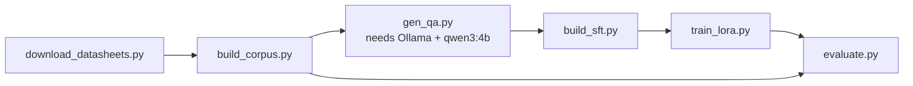

# ChipDoc AI

**Ask a microcontroller datasheet questions from your terminal, and get answers that come from the datasheet, with page numbers.**

```
$ python -m chipdoc dataset/raw/13_LPC1768.pdf
╭──────────────────────────── ChipDoc ────────────────────────────╮
│ 13_LPC1768.pdf  269 passages  |  Qwen3-0.6B (fine-tuned)          │
╰──────────────────────────────────────────────────────────────────╯
❯ What is the maximum CPU clock of the LPC1768?
Answer: The LPC1768 operates at CPU frequencies of up to 100 MHz [p.1]
Searched: p.1, p.6, p.2
```

ChipDoc is a Retrieval-Augmented Generation (RAG) system:

1. It splits the PDF into page-bounded passages and indexes them with **hybrid search**: dense `bge-small` embeddings plus BM25 keywords.
2. For each question it retrieves the 5 most relevant passages.
3. A **Qwen3-0.6B** model, fine-tuned with LoRA on about 2k datasheet QA examples, writes a short answer **only from those passages**. It cites pages and replies `Not found in the provided datasheet.` when the passages don't contain the answer.

Everything runs locally on a 4 GB laptop GPU. Nothing is sent to the internet.

## Quickstart

```bash
python -m venv myenv && source myenv/bin/activate
pip install -r requirements.txt

python -m chipdoc path/to/datasheet.pdf            # interactive
python -m chipdoc path/to/datasheet.pdf -q "What is the supply voltage range?"
python -m chipdoc path/to/datasheet.pdf --base     # without the fine-tuned adapter
```

In the REPL: `/sources` shows the passages behind the last answer, and `/quit` exits.
The first run on a PDF extracts and indexes it, which takes about 1–3 minutes for a few hundred pages. After that it is cached in `~/.cache/chipdoc/`.

## Repository layout

| Path | What |
|---|---|
| `chipdoc/` | The application: `ingest.py` (PDF → passages), `index.py` (hybrid search), `generate.py` (prompt + model), `__main__.py` (terminal app) |
| `scripts/download_datasheets.py` | Fetch vendor datasheets into `dataset/raw/` |
| `scripts/build_corpus.py` | Extract, chunk and index every PDF → `dataset/index/<name>/` |
| `scripts/gen_qa.py` | Teacher model (qwen3:4b via Ollama) writes grounded QA pairs → `dataset/qa/` |
| `scripts/build_sft.py` | Filter QA pairs, build RAFT-style training data, hold out test datasheets → `dataset/sft/` |
| `scripts/train_lora.py` | LoRA fine-tune of Qwen3-0.6B → `models/chipdoc-qwen3-0.6b-lora/` |
| `scripts/evaluate.py` | Retrieval and answer metrics on held-out datasheets → `results/` |
| `docs/` | [Architecture](docs/architecture.md), [Dataset](docs/dataset.md), [Training](docs/training.md), [Evaluation](docs/evaluation.md) |

## Reproducing the pipeline



```bash
python scripts/download_datasheets.py
python scripts/build_corpus.py
ollama pull qwen3:4b && python scripts/gen_qa.py --per-doc 40
python scripts/build_sft.py
curl -s localhost:11434/api/generate -d '{"model":"qwen3:4b","keep_alive":0}'   # free the GPU
python scripts/train_lora.py
python scripts/evaluate.py retrieval
python scripts/evaluate.py answers --system ft
python scripts/evaluate.py report
```

Check the GPU with `python scripts/gpu_check.py`.

## Dataset

30 datasheets from STMicroelectronics, Espressif, Raspberry Pi, Microchip (AVR, PIC, SAM), Texas Instruments, NXP and Nordic, from 8 to 1,459 pages each. See [docs/dataset.md](docs/dataset.md).
The datasheets are the vendors' publicly available documents and remain their copyright.
