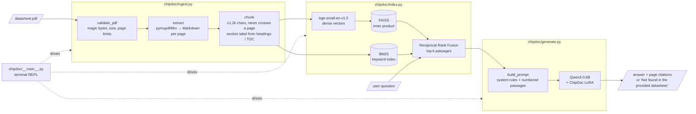
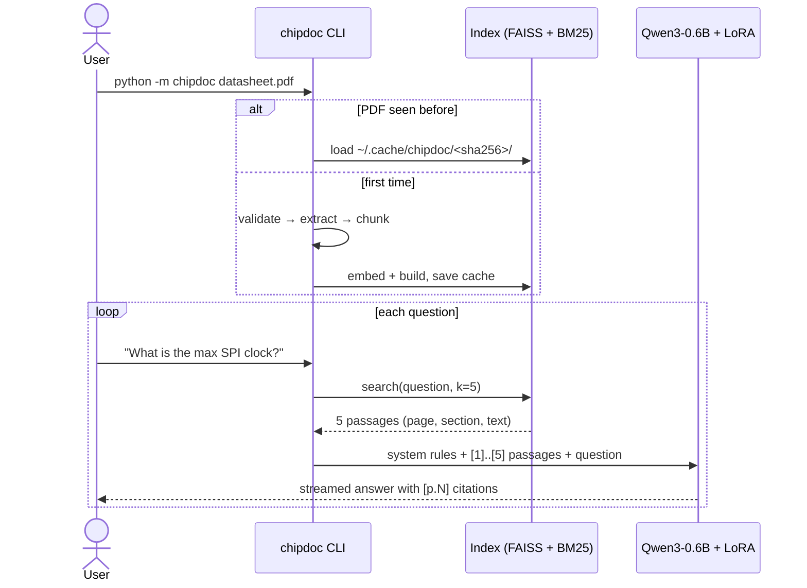

# Architecture

ChipDoc answers questions about a microcontroller datasheet **only from the
datasheet itself**. It is a Retrieval-Augmented Generation (RAG) system: find
the few passages that matter, then let a small language model write the answer
from them, citing pages.

Everything runs locally on one consumer GPU (tested on an RTX 3050, 4 GB).

## Components

| Module | Responsibility |
|---|---|
| `chipdoc/ingest.py` | Validate the input PDF, extract per-page Markdown, strip running headers/footers, split into page-bounded chunks with a section label. |
| `chipdoc/index.py` | Embed chunks, build FAISS + BM25, fuse rankings, cache per PDF (SHA-256 of the file). |
| `chipdoc/generate.py` | The single prompt format used for both training and inference; loads Qwen3-0.6B and the LoRA adapter; streams answers. |
| `chipdoc/__main__.py` | The terminal app. |
| `scripts/` | Offline pipeline: download datasheets, build the corpus, generate QA, build SFT data, train, evaluate. |

## Query flow

## Why these choices

- **Page-bounded chunks of ~1.2k characters.** bge-small reads at most 512
  tokens. The original 8k-character chunks were mostly invisible to the
  embedder. Keeping chunks inside one page makes every citation exact.
- **Hybrid retrieval.** Dense vectors match meaning ("how fast can the
  CPU run" ↔ "maximum frequency 168 MHz"). BM25 matches exact identifiers that
  embedders blur (`TIM2_CCR1`, `PA9`, `0x40021000`). Reciprocal Rank Fusion
  combines the two rankings without needing to tune score scales.
- **Small generator, fine-tuned for grounding.** A 0.6B model is fast on a
  laptop GPU. The fine-tune (see [training.md](training.md)) teaches it the
  narrow skill this tool needs: read 5 passages, copy the right value, cite
  the page, and refuse when the passages don't contain the answer.
- **One prompt function** (`build_prompt`) for training and inference, so
  the format the model sees at inference is exactly the format it was trained on.

## Security and privacy

- Everything is local: no datasheet text or question leaves the machine.
- The CLI validates its input: the file must exist, start with the `%PDF-`
  magic bytes, and be at most 100 MB and 2000 pages.
- Indexes are stored as JSON + FAISS, never pickle. Loading a pickle can
  execute code, and the cache sits next to user-supplied data.
- No personal data is collected or stored. The cache holds only datasheet text.
