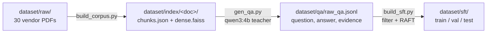
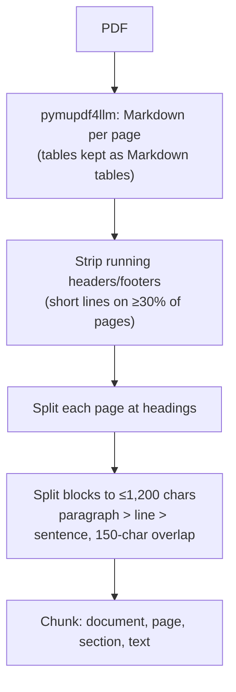

# Dataset

There are three layers, each built from the one before:

## 1. Corpus: 30 datasheets

The original 15 datasheets plus 15 added for vendor and architecture variety.
Sizes range from 8-page summaries to 1,400+ page full reference manuals.
They cover AVR, PIC, ARM Cortex-M0+/M3/M4/M7/M33, Xtensa, RISC-V and MSP430 cores.

| # | Datasheet | Vendor | Pages | Chunks | QA chunks sampled | Split |
|---|---|---|---|---|---|---|
| 1 | STM32F407VG | ST | 206 | 481 | 39 | train |
| 2 | STM32F103C8 | ST | 114 | 281 | 36 | **test** |
| 3 | STM32H743ZI | ST | 198 | 465 | 37 | train |
| 4 | STM32G431CB | ST | 357 | 864 | 39 | train |
| 5 | ESP32-S3 | Espressif | 87 | 286 | 40 | train |
| 6 | ESP32-WROOM-32E | Espressif | 52 | 143 | 40 | train |
| 7 | RP2040 | Raspberry Pi | 642 | 2410 | 40 | train |
| 8 | ATmega328P | Microchip (AVR) | 294 | 1011 | 40 | train |
| 9 | ATtiny85 | Microchip (AVR) | 8 | 18 | 7 | train |
| 10 | PIC16F877A | Microchip (PIC) | 234 | 714 | 40 | train |
| 11 | MSP430FR6989 | TI | 188 | 595 | 40 | train |
| 12 | TM4C123GH6PM | TI | 1410 | 3754 | 40 | train |
| 13 | LPC1768 | NXP | 93 | 269 | 40 | **test** |
| 14 | SAMD21G18A | Microchip (SAM) | 1161 | 5024 | 40 | train |
| 15 | nRF52832 | Nordic | 560 | 2576 | 40 | train |
| 16 | ESP32-C3 | Espressif | 76 | 216 | 40 | train |
| 17 | ESP8266EX | Espressif | 31 | 71 | 30 | **test** |
| 18 | ESP32-C6 | Espressif | 86 | 276 | 40 | train |
| 19 | ATmega2560 | Microchip (AVR) | 435 | 1501 | 40 | train |
| 20 | ATmega32U4 | Microchip (AVR) | 438 | 1658 | 39 | **test** |
| 21 | PIC18F45K22 | Microchip (PIC) | 539 | 1531 | 39 | train |
| 22 | SAM3X8E | Microchip (SAM) | 1459 | 4580 | 40 | train |
| 23 | MSP430G2553 | TI | 87 | 198 | 40 | train |
| 24 | CC2640R2F | TI | 74 | 194 | 39 | train |
| 25 | MSPM0G3507 | TI | 120 | 391 | 40 | train |
| 26 | ESP32-S2 | Espressif | 65 | 198 | 40 | train |
| 27 | ESP32-H2 | Espressif | 69 | 183 | 40 | train |
| 28 | MSP430FR2433 | TI | 92 | 246 | 40 | **test** |
| 29 | CC2652R | TI | 61 | 187 | 39 | train |
| 30 | ATtiny1614 | Microchip (AVR) | 598 | 2078 | 40 | train |
| | **Total** | | **9,834** | **32,399** | **1,144** | |

**Datasheets held out for testing** (never seen in training): STM32F103C8, LPC1768,
ESP8266EX, ATmega32U4, MSP430FR2433. That's one per vendor family, so the
test measures the real use case: a datasheet the model has never seen.

`scripts/download_datasheets.py` fetches the added datasheets. ST's site
blocks scripted downloads, so the script prints those URLs for manual download.

## 2. Chunking

- **A chunk never crosses a page**, so every answer cites one exact page.
- **The section label** is the most recent Markdown heading (carried across
  pages), falling back to the PDF bookmarks. PDFs with no bookmarks still
  work; the previous chunker produced zero chunks for them.
- **1,200 characters** (about 400–500 tokens of datasheet text) fits
  `bge-small`'s 512-token window. Previously, chunks of up to 8,000
  characters were cut off by the embedder.

## 3. QA generation and filtering

| Stage | Count |
|---|---|
| Chunks sent to the teacher | 1,144 |
| QA pairs generated | 2,293 |
| Dropped: format (vague or meta question, bad length) | 31 |
| Dropped: unsupported (evidence or number not in chunk) | 252 |
| Dropped: duplicate | 20 |
| **Kept** | **1,990 (87%)** |
| Train / val examples (from 25 datasheets) | 1,569 / 80 |
| ...of which "Not found" refusal examples | 257 |
| Test QA pairs (5 held-out datasheets) | 341 |
| Train example length, tokens (p50 / p95 / max) | 1,490 / 2,423 / 4,213 |

Examples longer than 2,560 tokens (3%) are dropped at training time instead of
truncated, because truncation would cut off the answer.

**Known noise:** the number check can't catch a wrong *unit*. One sample
reads "79 mA/MHz" where the table says µA/MHz. A small teacher is the
trade-off for running fully offline. A stronger teacher (or human review of the
test set) is the obvious next step.

**Teacher:** `qwen3:4b`, run locally through Ollama (thinking off, temperature 0.3,
JSON-schema-constrained output). For each sampled chunk it writes 2 questions,
each with a short answer and a **verbatim evidence span** from the chunk.

**Sampling:** up to 40 chunks per datasheet, seeded per document. Chunks are skipped
if they are under 500 characters, have no digits, are TOC-like, or come from
revision-history, ordering, legal or package-marking sections.

**Filters** (in `build_sft.py`). A pair is kept only if:

1. The question is 15–300 characters, ends with `?`, and doesn't say "excerpt",
   "this table" or similar (it must stand alone).
2. The evidence appears in the chunk, verbatim or with at least 90% of its words.
3. **Every number in the answer appears in the chunk.** This is the main
   guard against the teacher hallucinating values.
4. The question isn't a duplicate.

Then each kept pair becomes a RAFT-style training example. See [training.md](training.md).
