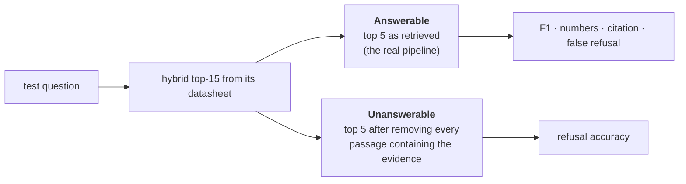

# Evaluation

Every number here comes from the **5 held-out datasheets** (STM32F103C8,
LPC1768, ESP8266EX, ATmega32U4, MSP430FR2433). Neither the fine-tune nor
anything else saw them during training. Reproduce with `scripts/evaluate.py`;
raw predictions are in `results/`.

## Test-set quality

The test QA pairs come from the same teacher pipeline as the training data. Of
**30 randomly sampled pairs checked by hand, 26 (87%) were correct and
answerable from their evidence**. The 4 bad ones: one meaningless question, one
answer not supported by its evidence, one that gave a minimum value as if it
were the typical value, and one garbled question. So treat the answer metrics
below as having roughly ±10% label noise. Comparisons *between* systems are
still fair, because every system is scored on the same items.

## Retrieval

341 test questions; a hit means a retrieved chunk is the source chunk or contains the evidence span.

| Retriever | Recall@1 | Recall@3 | Recall@5 | Recall@10 | MRR@10 |
|---|---|---|---|---|---|
| Dense (bge-small-en-v1.5) | 0.53 | 0.74 | 0.79 | 0.89 | 0.65 |
| BM25 | 0.65 | 0.81 | 0.84 | 0.89 | 0.73 |
| **Hybrid (RRF)** | 0.63 | **0.84** | **0.88** | **0.92** | **0.74** |

The app passes the top 5 passages to the model, so **Recall@5 is the ceiling on
answer accuracy**. Hybrid lifts it from 0.79 to 0.88.

*Caveat:* the questions were written by looking at the passage, so they reuse
its words. That favours BM25 more than real user questions would, and
real-world dense performance relative to BM25 is likely better than shown here.

## Answers

100 test questions (seeded random sample of the 341), each asked twice:

Answer-quality metrics are computed only where retrieval actually found the evidence
(92 of 100), so they measure the generator, not the retriever.

| Metric | Base Qwen3-0.6B | **Qwen3-0.6B + ChipDoc LoRA** |
|---|---|---|
| Token F1 vs. reference answer | 0.50 | **0.56** |
| Numbers in reference answer reproduced | 0.72 | **0.75** |
| **Cites the correct page** (of non-refusals) | 0.22 | **0.91** |
| Refuses although the evidence was retrieved (lower is better) | **0.05** | 0.15 |
| **Refuses when the evidence is absent** | 0.30 | **0.74** |

*The 4B teacher (qwen3:4b) isn't in this table: the local Ollama build reasons out
loud even with thinking disabled, so it couldn't be scored in a comparable way in
the time available. `evaluate.py answers --system teacher` is wired up for a build
that honours `/no_think`.*

### What the fine-tune changed

- **Grounding, the main goal.** On unanswerable inputs the base model invented an
  answer 70% of the time. The fine-tune cut that to 26%, and 47 of the base model's
  hallucinations became correct refusals. A typical fix:
  - *Q: What does ULP Advisor check your code against?* (evidence removed)
  - Base: "…against an energy-based code analysis tool to optimize it for ultra-low power consumption [p.92]." The answer is invented, and so is the citation.
  - Fine-tuned: "Not found in the provided datasheet."
- **Citations** went from 0.22 to 0.91 correct. The base model usually cites passage
  numbers (`[1]`) or no page at all.
- **Answer accuracy** improved modestly (F1 +0.06). A 0.6B model reading 5
  passages is mostly limited by reading tables, not by the answer format.

### Costs and failure modes

- **Over-caution:** false refusals rose from 5% to 15% (14 of 92). They are mostly
  questions whose answer sits inside a dense register or electrical table, e.g.
  "What register enables the noise canceler?". It's the price of the 20% refusal
  examples in training. Lowering `NO_ORACLE_RATE` in `build_sft.py` trades refusal
  accuracy back for coverage.
- **Retrieval is the ceiling:** with the evidence missing from the top 5 for
  8–12% of questions, no generator can answer those. A cross-encoder re-ranker is
  the cheapest next improvement.
- **Label noise:** about 13% of reference answers are flawed (see above), which
  depresses F1 for every system equally.

### Latency

On an RTX 3050 Laptop GPU, the evaluation ran at about 1.5 s per question
(retrieval + generation). Hybrid retrieval alone takes 47 ms per query for a 93-page
datasheet and 83 ms for a 1,459-page one, measured on the CPU. Indexing a new PDF takes about 1–3 minutes per few
hundred pages (text extraction dominates), and the index is cached afterwards.
