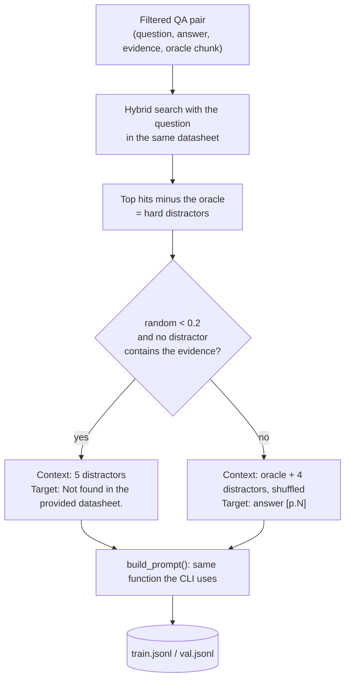

# Training

## Goal

A general chat model, even a good one, tends to answer datasheet questions
from memory, round numbers, and invent values when retrieval misses. The
fine-tune teaches Qwen3-0.6B one narrow behaviour:

> Read 5 numbered passages. If one answers the question, copy the value
> exactly and cite its page. If none does, say `Not found in the provided datasheet.`

## Data: RAFT-style examples

We follow the RAFT idea (Retrieval-Augmented Fine-Tuning; also used in paper
[2] of our literature survey). The model is trained on examples that look
exactly like inference: the question plus retrieved passages, including
**distractors**.

- **Hard distractors** come from the real retriever, so they look relevant:
  same peripheral, neighbouring pages. The model has to pick the right one
  instead of the first one.
- **No-oracle examples (~20%)** teach refusal. Before an example becomes a
  refusal, we check that no distractor contains the evidence, so we never
  train the model to refuse an answerable question.
- **The target appends `[p.N]`** with the oracle's page, so citing becomes a habit.
- Loss is computed **on the answer tokens only**. The prompt is masked.

## Model and hyperparameters

| Setting | Value | Why |
|---|---|---|
| Base model | `Qwen/Qwen3-0.6B` | Small enough to train and serve on a 4 GB GPU, with fast answers |
| Method | LoRA, r=16, α=32, dropout 0.05 | About 1.7% of weights trainable; the adapter is a few MB |
| Target modules | q, k, v, o, gate, up, down projections | All linear layers: better quality than attention-only at the same rank |
| Precision | bf16 weights, gradient checkpointing | Fits 2.5k-token sequences in 4 GB |
| Batch | 1 × 16 gradient accumulation | Qwen's 151k vocabulary makes logits about 1.5 GB per 2.5k-token sequence |
| Learning rate | 2e-4, cosine, 3% warmup | Standard for LoRA |
| Epochs | 2 | Small dataset; validation loss is checked each epoch |
| Max length | 2560 tokens | Covers 5 passages of about 1.2k characters plus the answer |
| Thinking mode | off (`enable_thinking=False`) | Short factual answers, low latency |

Run: `python scripts/train_lora.py` (stop Ollama first; it holds VRAM).

## Results

See [evaluation.md](evaluation.md).
